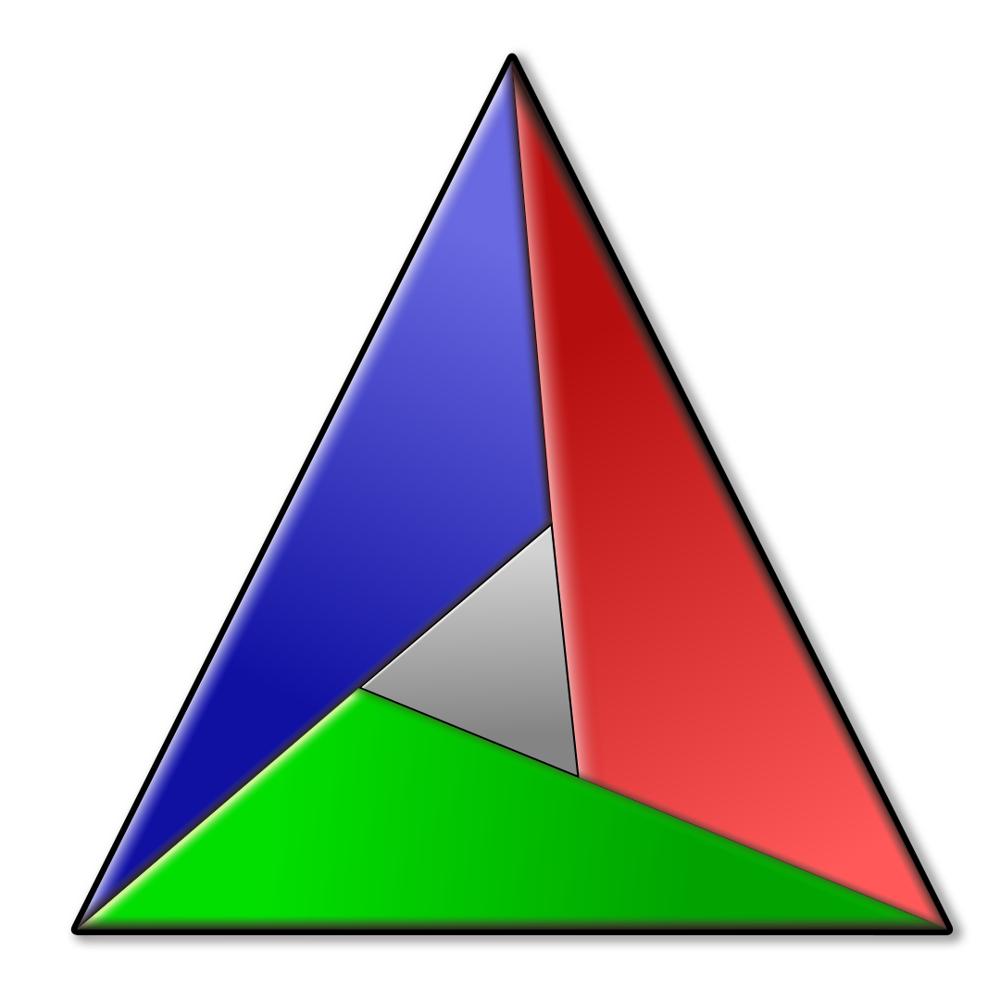

### Hello Smart People, I'm Chris!

## I'm a Hobbyist Software Developer

- I consider myself a problem solver.
  Working on problems we set ourself for fun is really enjoyable.
  But solving real people's problems and making their lives a little better is the biggest motivator I can imagine.
- The bigger the project, the better; even if it doesn't quite suit my taste.
- I always prefer to work in a team rather than on my own.
  I like people—people are great!
- Linux vs Windows? Linux For The Win! But Windows users shouldn't be joked about; they have enough problems already😉
- I'm always looking for cool projects to participate in, so hook me up if you have something in mind.

## Main Languages

Click to expand.

- C++
- TypeScript
- Python

## Main Tools

Click to expand.

- Neovim
- Bash
- CMake
- Premake
- gcc/make/gdb/...
- Manim CE
- Blender
- git (duh)
- LaTex
- SDL2
- OpenGL
- Gephi
- Flask
- webpack

## Public Projects

Click to expand.

`~` -> work in progress

`*` -> unusable state

### C++

- [Neural Network](https://github.com/christopher-besch/neural_network)
- [Ray Tracer](https://github.com/christopher-besch/ray_tracer)
- [Lynton](https://github.com/christopher-besch/lynton)
- [Cryptography](https://github.com/christopher-besch/cryptography)
- [39th BWINF Round 2](https://github.com/christopher-besch/bwinf_39_round2)
- [C++ Go Fast](https://github.com/christopher-besch/cpp_go_fast)
- [C++ Reference](https://github.com/christopher-besch/cpp_reference)
- `*` [Lynton Legacy](https://github.com/christopher-besch/lynton_legacy)

### TypeScript

- [Big Blue Button Autostatus](https://github.com/christopher-besch/bbb_autostatus)
- [Lake Visualizer](https://github.com/christopher-besch/lake_visualizer)
- [Book Page Converter](https://github.com/christopher-besch/book_page_converter)
- [Who am I](https://github.com/christopher-besch/who_am_i)
- [Physics Words](https://github.com/christopher-besch/physics_words)
- [TypeScript Reference](https://github.com/christopher-besch/typescript_reference)

### Python

- `~` [ToddLinux](https://github.com/ToddLinux/ToddLinux)
- `~` [Manim Editor](https://github.com/ManimEditorProject/manim_editor)
- [Manim Web Presenter](https://github.com/christopher-besch/manim_web_presenter)
- [Manim CE](https://github.com/ManimCommunity/manim)
- [Manim Reference](https://github.com/christopher-besch/manim_reference)
- [Project Omega](https://github.com/christopher-besch/project_omega)
- [MC Royale Supervisor](https://github.com/christopher-besch/mc_royale_supervisor)
- [OHG Plan Parser](https://github.com/christopher-besch/ohg_plan_parser)
- [Time Table Planner](https://github.com/christopher-besch/time_table_planner)
- [Technik^3 Plan](https://github.com/christopher-besch/technik3-plan)
- [ARG Toolset](https://github.com/christopher-besch/arg_toolset)
- [39th BWINF Round 1](https://github.com/christopher-besch/bwinf_39_round1)
- [37th BWINF Round 1](https://github.com/christopher-besch/bwinf_37_round1)
- [Lofi Girl Downloader](https://github.com/christopher-besch/lofi_girl_downloader)

More

### Bash

- [Bash Reference](https://github.com/christopher-besch/bash_reference)

### LaTeX

- [LaTeX Reference](https://github.com/christopher-besch/latex_reference)

### Assembly

- [Assembly Reference](https://github.com/christopher-besch/assembly_reference)

### Blender

- [Models](https://github.com/christopher-besch/blender_models)

### Configs

- [LunarVim](https://github.com/christopher-besch/lvim_like_me)
- [Neovim](https://github.com/christopher-besch/nvim_like_me)
- [Kitty](https://github.com/christopher-besch/kitty_like_me)
- [Miscellaneous](https://github.com/christopher-besch/miscellaneous_configs)

### Java

- `~`[Social Blog](https://github.com/pascal-kuschkowitz/Inf-Proj-ProductDev)
- [Encryption](https://github.com/christopher-besch/java_encryption)
- [Sorting Algorithms](https://github.com/christopher-besch/sorting_algorithms)

