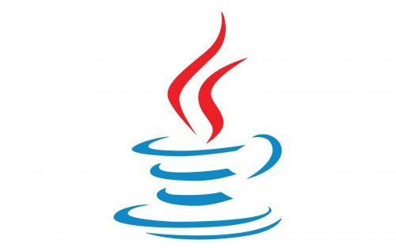
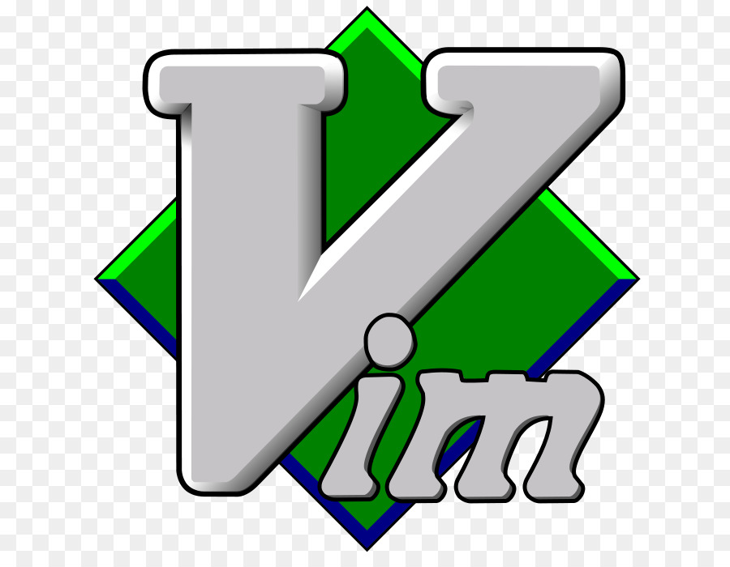

### Hello Smart People, I'm Chris!

## I'm a Hobbyist Software Developer

- I love creating things, building websites, horribly over-engineering everything that isn't too serious and making the world a better place; and people! People are great!
- The bigger the project, the better, even if it doesn't quite suit my taste.
- I always prefer to work in a team rather than on my own.
- I consider life to start at the age of sixteen; did I even exist before?
- Linux vs Windows? Linux For The Win! But Windows users shouldn't be hated or laughed at; they have enough problems with their operating system already😉
- I'm always looking for cool open-source projects to participate in, so just hook me up if you have something in mind. Except for Java I'll work for free; you'd have to pay me really really well to make me write Java.

### Main Languages

- C++
- Python
- TypeScript
- Java

### Main Tools

- Vim
- Bash
- Visual Studio Code
- Premake
- gcc/make
- git (duh)
- Latex
- OpenGL
- Gephi

## [Repositories](https://github.com/christopher-besch?tab=repositories)

### C++

- [C++ Reference](https://github.com/christopher-besch/cpp_reference)
- [OpenGL Reference](https://github.com/christopher-besch/opengl_reference)
- [Cryptography](https://github.com/christopher-besch/cryptography)
- [Ray Tracer](https://github.com/christopher-besch/ray_tracer)
- [Lynton Game Engine](https://github.com/christopher-besch/lynton)

### Python

- [Time Table Planner](https://github.com/christopher-besch/time_table_planner)
- [OHG Plan Parser](https://github.com/christopher-besch/ohg_plan_parser)
- [Technik^3 Plan](https://github.com/christopher-besch/technik3-plan)
- [MC Royale Supervisor](https://github.com/christopher-besch/mc_royale_supervisor)
- [ARG Toolset](https://github.com/christopher-besch/arg_toolset)
- [39th BWINF Round 1](https://github.com/christopher-besch/bwinf_39_round1)
- [37th BWINF Round 1](https://github.com/christopher-besch/bwinf_37_round1)
- [Anti Primes](https://github.com/christopher-besch/anti_primes)
- [Zipf's Law](https://github.com/christopher-besch/zipfs_law)
- [Towers of Hanoi](https://github.com/christopher-besch/towers_of_hanoi)
- [Little Circles](https://github.com/christopher-besch/little_circles)
- [Brute Force Multiple Choice](https://github.com/christopher-besch/brute_force_multiple_choice_tasks)
- [Cora Wrapper](https://github.com/christopher-besch/python_cora_wrapper)

### TypeScript/JavaScript

- [TypeScript Reference](https://github.com/christopher-besch/typescript_reference)
- [Physics Words](https://github.com/christopher-besch/physics_words)

### Web (Python, TypeScript, HTML, CSS)

- [Project Omega](https://github.com/christopher-besch/project_omega)
- [Who am I](https://github.com/christopher-besch/who_am_i)

### Bash

- [Bash Reference](https://github.com/christopher-besch/bash_reference)

### LaTex

- [LaTex Reference](https://github.com/christopher-besch/latex_reference)
- [Bibliography](https://github.com/christopher-besch/bibliography)

### Java

- [Encrpytion](https://github.com/christopher-besch/java_encryption)
- [Sorting Algorithms](https://github.com/christopher-besch/sorting_algorithms)

## [Gists](https://gist.github.com/christopher-besch)

- [get_longest_videos_from_youtube_playlist](https://gist.github.com/christopher-besch/5b5e3af95ea89b2c787502eae19ca1fb)
