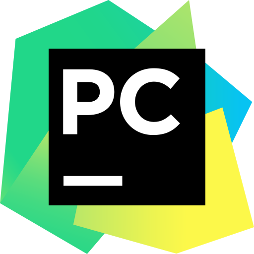
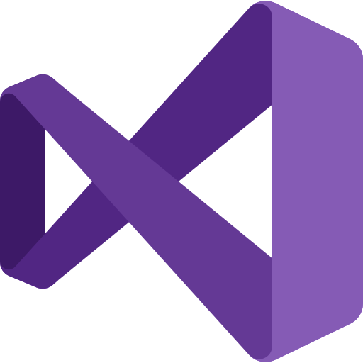

### Hello Smart People, I'm Chris!

## I'm a Hobbyist Software Developer

- I'm currently learning [Computer Networking](https://www.pearson.com/us/higher-education/program/Kurose-Computer-Networking-A-Top-Down-Approach-7th-Edition/PGM1101673.html) and [Ray Tracing](https://raytracing.github.io/books/RayTracingInOneWeekend.html).
- The bigger the project, the better, even if it doesn't quite suit my taste.
- I always prefer to work in a team rather than on my own.
- Linux vs Windows? Both; Cross-platform FTW!

### Main Languages
- C++
- Python
- Java
- JavaScript

### Main Tools
- Visual Studio Code
- Premake
- gcc/make
- PyCharm
- Visual Studio
- git (duh)
- Latex
