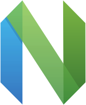
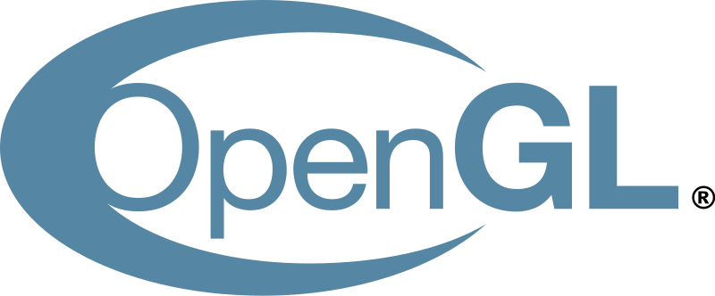

### Hello Smart People, I'm Chris!

## I'm a Hobbyist Software Developer

- I consider myself a problem solver.
  Working on problems we set ourself for fun is really enjoyable.
  But solving problems of real people and making their lives a little better is the biggest motivator I could imagine.
- The bigger the project, the better, even if it doesn't quite suit my taste.
- I always prefer to work in a team rather than on my own.
  Cuz I like people—people are great!
- Linux vs Windows? Linux For The Win! But Windows users shouldn't be hated or laughed at; they have enough problems already😉
- I'm always looking for cool open-source projects to participate in, so just hook me up if you have something in mind.
  Except for Java I'll work for free; you'd have to pay me really really really well to make me endure writing Java.

## Main Languages

Click to expand.

- C++
- TypeScript
- Python

## Main Tools

Click to expand.

- Neovim
- Bash
- Visual Studio Code
- Premake
- gcc/make/gdb
- Blender
- git (duh)
- LaTex
- OpenGL
- Gephi
- Flask

## Projects

Click to expand.

`~` -> work in progress
`*` -> unusable state

C++

- `~` [Neural Network](https://github.com/christopher-besch/neural_network) ([Markus' Sister Project](https://github.com/MarcasRealAccount/NeuralNetwork))
- [C++ Reference](https://github.com/christopher-besch/cpp_reference)
- [C++ Reference](https://github.com/christopher-besch/cpp_reference)
- `~` [SDL2 Reference](https://github.com/christopher-besch/sdl2_reference)
- [C++ Utils](https://github.com/christopher-besch/cpp_utils)
- `*` [Lynton](https://github.com/christopher-besch/lynton)
- [39th BWINF Round 2](https://github.com/christopher-besch/bwinf_39_round2)
- [Cryptography](https://github.com/christopher-besch/cryptography)
- [Ray Tracer](https://github.com/christopher-besch/ray_tracer)
- `*` [Lynton Legacy](https://github.com/christopher-besch/lynton_legacy)

TypeScript

- [Big Blue Button Autostatus](https://github.com/christopher-besch/bbb_autostatus)
- [Lake Visualizer](https://github.com/christopher-besch/lake_visualizer)
- [TypeScript Reference](https://github.com/christopher-besch/typescript_reference)
- [Who am I](https://github.com/christopher-besch/who_am_i)
- [Physics Words](https://github.com/christopher-besch/physics_words)

Python

- [Time Table Planner](https://github.com/christopher-besch/time_table_planner)
- [Technik^3 Plan](https://github.com/christopher-besch/technik3-plan)
- [ARG Toolset](https://github.com/christopher-besch/arg_toolset)
- [39th BWINF Round 1](https://github.com/christopher-besch/bwinf_39_round1)
- [37th BWINF Round 1](https://github.com/christopher-besch/bwinf_37_round1)
- [Anti Primes](https://github.com/christopher-besch/anti_primes)
- [Zipf's Law](https://github.com/christopher-besch/zipfs_law)
- [Towers of Hanoi](https://github.com/christopher-besch/towers_of_hanoi)
- [Little Circles](https://github.com/christopher-besch/little_circles)
- [Brute Force Multiple Choice](https://github.com/christopher-besch/brute_force_multiple_choice_tasks)
- `*` [Cora Wrapper](https://github.com/christopher-besch/python_cora_wrapper)
- [Get Longest Videos from YouTube Playlist](https://gist.github.com/christopher-besch/5b5e3af95ea89b2c787502eae19ca1fb)

Flask (Python, TypeScript, HTML, CSS)

- [Project Omega](https://github.com/christopher-besch/project_omega)
- [MC Royale Supervisor](https://github.com/christopher-besch/mc_royale_supervisor)
- [OHG Plan Parser](https://github.com/christopher-besch/ohg_plan_parser)

Bash

- [Bash Reference](https://github.com/christopher-besch/bash_reference)

LaTex

- [LaTex Reference](https://github.com/christopher-besch/latex_reference)
- [Bibliography](https://github.com/christopher-besch/bibliography)

Assembly

- [Assembly Reference](https://github.com/christopher-besch/assembly_reference)

Blender

- [Models](https://github.com/christopher-besch/blender_models)

Configs

- [Neovim](https://github.com/christopher-besch/nvim_like_me)
- [Miscellaneous Configs](https://github.com/christopher-besch/miscellaneous_configs)

Java

- [Encryption](https://github.com/christopher-besch/java_encryption)
- [Sorting Algorithms](https://github.com/christopher-besch/sorting_algorithms)

